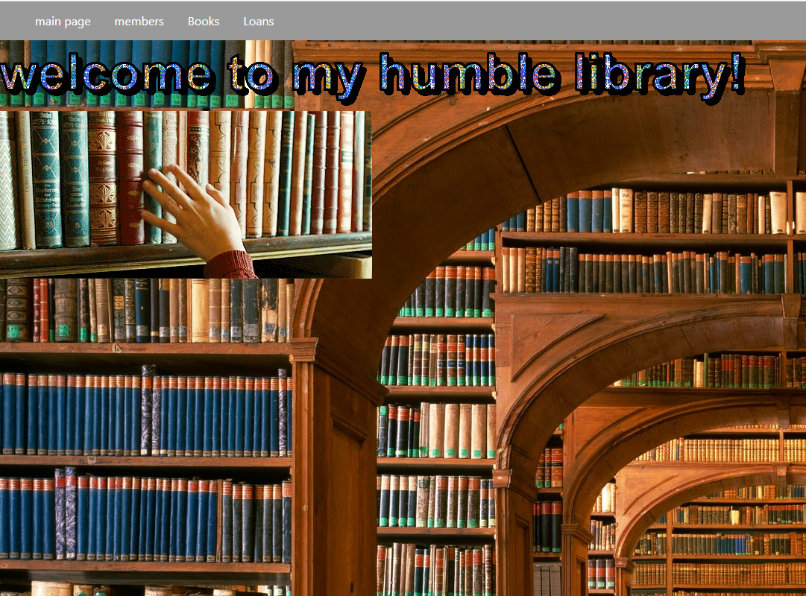

### Library Management System

A Python Flask based Library Management System. This Flask app has all the features of a Library Management System like adding, removing, and creating copies of books.

### Screenshot



---

---

### technology  in the project
1. flask
2. sqlalchemy
3. jinja2
4. phyton 

### Start the app

- in order to start the appliction you need to install virtual environment in few simple steps
- 1. first you need to open your terminal and type:
 ```
 python -m virtualenv venv
 ```
- 2. type:
 ```
 venv\Scripts\activate
 ```
- 3. after your virtual environment opend you need to install the requirements by typing in the terminal:
```
pip install -r requirements.txt
```

- 4. populate data:
in order to populate the data you need to open the init_db file and applied it upon the project in order to start with some data base
go to the file 'init_db.py'
and open the terminal and start it by typing:
```
py init_db 
```  

- 5. and then you can start the app by typing:
```
py book_library
```


# Project made and maintained by niv malachi